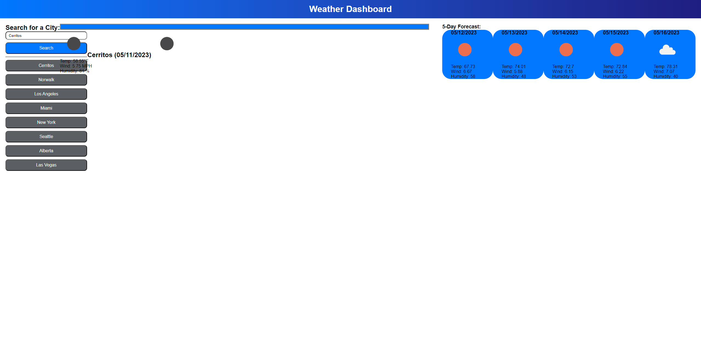

# Weather Dashboard

## Description
1. Searching for a city will add it to your history and present you with current/future weather conditions
2. Viewing the current conditions will provide the City name, date, weather icon, temperature, humidity and wind speed
3. Checking the future weather conditions will display the 5-Day forecast with all given variables
4. Clicking on a city from the search history also provides the current/future weather conditions

## Mock Up

## Screenshots

## Links
[Application Link - Open in a new tab](https://jpascual007.github.io/EDX-homework06/)
